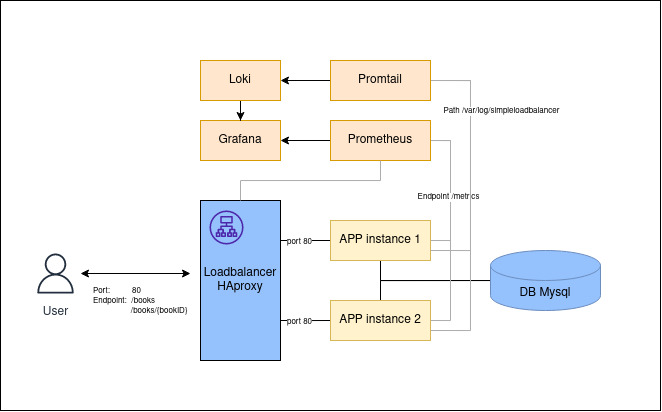
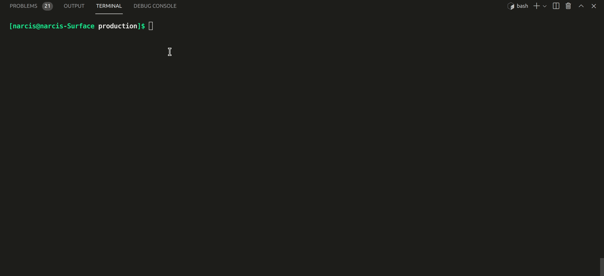

<div id="top"></div>
<!--
*** Thanks for checking out the Best-README-Template. If you have a suggestion
*** that would make this better, please fork the repo and create a pull request
*** or simply open an issue with the tag "enhancement".
*** Don't forget to give the project a star!
*** Thanks again! Now go create something AMAZING! :D
-->


<!-- PROJECT SHIELDS -->
<!--
*** I'm using markdown "reference style" links for readability.
*** Reference links are enclosed in brackets [ ] instead of parentheses ( ).
*** See the bottom of this document for the declaration of the reference variables
*** for contributors-url, forks-url, etc. This is an optional, concise syntax you may use.
*** https://www.markdownguide.org/basic-syntax/#reference-style-links
-->
[![Contributors][contributors-shield]][contributors-url]
[![Forks][forks-shield]][forks-url]
[![Stargazers][stars-shield]][stars-url]
[![Issues][issues-shield]][issues-url]
[![MIT License][license-shield]][license-url]
[![LinkedIn][linkedin-shield]][linkedin-url]


<!-- TABLE OF CONTENTS -->
<details>
  <summary>Table of Contents</summary>
  <ol>
    <li>
      <a href="#about-the-project">About The Project</a>
      <ul>
        <li><a href="#built-with">Built With</a></li>
      </ul>
    </li>
    <li>
      <a href="#getting-started">Getting Started</a>
      <ul>
        <li><a href="#prerequisites">Prerequisites</a></li>
        <li><a href="#installation">Installation</a></li>
      </ul>
    </li>
    <li><a href="#usage">Usage</a></li>
    <li><a href="#roadmap">Roadmap</a></li>
    <li><a href="#contributing">Contributing</a></li>
    <li><a href="#license">License</a></li>
    <li><a href="#contact">Contact</a></li>
    <li><a href="#acknowledgments">Acknowledgments</a></li>
  </ol>
</details>


<!-- ABOUT THE PROJECT -->
# SimpleLoadbalancer
It's my assignment ;) .

## About The Assignment
<br/>



I created a load-balanced (public) REST API with golang, which serves some JSON from an Mysql database. with tow instances and also  monitoring, log aggregation and Docker-compose deploymen.

### Built With

List of major frameworks/libraries and services used to project. 

#### Golang Application
* gorm: database connection
* gin: web framework 
* ginprom: prometheus metrics exporter

#### Project launch
* Docker/Dockercompose: virtualization
* Haproxy: loadbalancer
* Mysql: database 
* Prometheus: metrics monitoring
* Loki and Promtail: log monitoring
* Grafana: monitoring dashboard
  
<p align="right">(<a href="#top">back to top</a>)</p>


<!-- GETTING STARTED -->
## Getting Started

To setting up project locally, get a local copy up and running follow these example steps.

### Prerequisites

You must have Docker, Docker-compose installed and git on your system.
* [Get Docker](https://docs.docker.com/get-docker/)
* [Install Docker Compose](https://docs.docker.com/compose/install/)

* [Installing Git](https://git-scm.com/book/en/v2/Getting-Started-Installing-Git)
  
### Installation

To Installing and setting up app and all stacks follow these steps.

1. Clone the repo
   ```sh
   git clone git@github.com:narcislinux/SimpleLoadbalancer.git
   ```
2. go to production directory, This folder contains all the files you need to launch a project with Docker Compos. 
   ```sh
    simpleLoadbalancer-old/production/
    ├── docker-compose.yml
    ├── grafana
    │   └── provisioning
    │       ├── dashboards
    │       │   ├── dashboard.yml
    │       │   ├── Haproxy.json
    │       │   ├── SimpleLoadbalancer Metric.json
    │       │   └── SimpleLoadbalncer Logs.json
    │       └── datasources
    │           └── datasource.yml
    ├── haproxy
    │   └── haproxy.cfg
    ├── prometheus
    │   └── prometheus.yml
    └── promtail
        └── docker-promtail.yml
   ```
3. Run docker compose
   ```sh
    docker-compose build
    docker-compose up -d
   ```
4. Check all contaners are up 
   ```sh
    docker-compose ps
   ```
<br/>


<p align="right">(<a href="#top">back to top</a>)</p>


<!-- USAGE EXAMPLES -->
## Usage

_For More detail about project's endpoints , please refer to the [Swagger](https://app.swaggerhub.com/apis/narcislinux/SimpleLoadbancer/0.0.0)._
* ./swagger.yaml

<p align="right">(<a href="#top">back to top</a>)</p>


<!-- ACKNOWLEDGMENTS -->
## Monitoring

### Metric
You can see 3 dashboard on grafana (grafana user "admin", password "admin"):

* SimpleLoadbalncer Metrics
* SimpleLoadbalncer Logs
* HAproxy

And the Haproxy dashboard is available on port 1936 (in local 127.0.0.1:1936). 

<br/>


<!-- MARKDOWN LINKS & IMAGES -->
<!-- https://www.markdownguide.org/basic-syntax/#reference-style-links -->
[contributors-shield]: https://img.shields.io/github/contributors/othneildrew/Best-README-Template.svg?style=for-the-badge
[contributors-url]: https://github.com/othneildrew/Best-README-Template/graphs/contributors
[forks-shield]: https://img.shields.io/github/forks/othneildrew/Best-README-Template.svg?style=for-the-badge
[forks-url]: https://github.com/othneildrew/Best-README-Template/network/members
[stars-shield]: https://img.shields.io/github/stars/othneildrew/Best-README-Template.svg?style=for-the-badge
[stars-url]: https://github.com/othneildrew/Best-README-Template/stargazers
[issues-shield]: https://img.shields.io/github/issues/othneildrew/Best-README-Template.svg?style=for-the-badge
[issues-url]: https://github.com/othneildrew/Best-README-Template/issues
[license-shield]: https://img.shields.io/github/license/othneildrew/Best-README-Template.svg?style=for-the-badge
[license-url]: https://github.com/othneildrew/Best-README-Template/blob/master/LICENSE.txt
[linkedin-shield]: https://img.shields.io/badge/-LinkedIn-black.svg?style=for-the-badge&logo=linkedin&colorB=555
[linkedin-url]: https://linkedin.com/in/othneildrew
[product-screenshot]: images/screenshot.png
